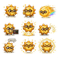

# Celestial Dev Pets — 日月地

Helios 日、Luna 月、Terra 地的角色聖經與靜態狀態原型。

> Unofficial fan-made experiment. Not affiliated with, endorsed by, or sponsored by OpenAI.

## 三隻本尊

| Helios 日 | Luna 月 | Terra 地 |
|---|---|---|
|  |  |  |

上方圖片是為 GitHub 顯示最佳化的角色預覽圖，不是 Codex 可直接安裝的動畫 atlas。

## Current status

**v0.1 — Character Bible / Static State Prototype**

目前可用於：

- 角色設計與狀態參考
- 獨立 renderer 原型
- 正式 Codex 動畫寵物的孵化來源

目前不可用於：

- 直接安裝成 Codex 原生動畫寵物

## 官方 Codex Pet Contract

依 OpenAI `hatch-pet` 的官方 contract：

- Atlas：`1536 × 1872`
- Grid：`8 columns × 9 rows`
- Cell：`192 × 208`
- PNG 或 WebP
- 透明背景
- 未使用格必須完全透明
- 不可加入標籤、格線、邊框、gutter 或格外陰影

本 repo 的 3 × 3 靜態狀態圖與上述正式規格不同。完整依據見 [`CONTRACT.md`](CONTRACT.md)。

## v0.1 狀態原型

```text
0 1 2   idle / waiting / running
3 4 5   review / jumping / waving
6 7 8   failed / happy / glow
```

每個狀態目前只有一張姿勢，不是逐格動畫。

## Roadmap

- [x] v0.1 — character bible and static state previews
- [x] v0.2 — Helios canonical character reference (`feat/helios-codex-pet`)
- [x] v0.3 — Helios single-row animation proof (`idle`, pending joint review)
- [ ] v0.4 — full Codex-compatible 8 × 9 Helios atlas
- [ ] v0.5 — Luna and Terra atlases
- [ ] v1.0 — validated installable pet packages

## 角色

### Helios 日
陽光開朗的算力太陽神。錯誤狀態：`timeout`。

### Luna 月
冷靜高效的夜班小編。錯誤狀態：`rate_limit`。

### Terra 地
穩重可靠的端側小地球。錯誤狀態：`out_of_memory`。

## License

Code and configuration files are provided under the MIT License. Visual assets remain experimental character-study material pending a dedicated asset license review.

## Phase 1 review package

The Helios canonical reference, six-frame idle proof, partial atlas, preview,
contact sheet, validator output, and QA record live under
[`phase1/helios/`](phase1/helios/). This is a review artifact, not an installable
complete pet; all non-idle rows are intentionally transparent.
